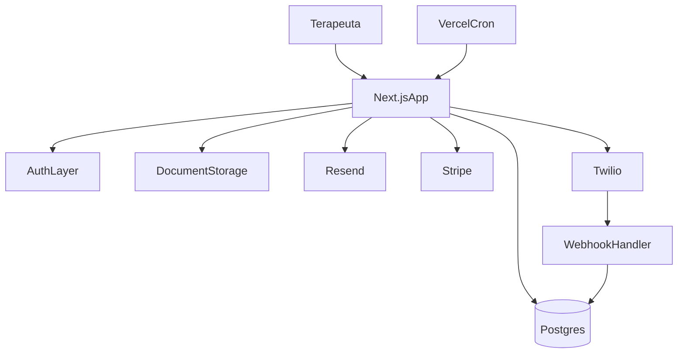

# Overview do Projeto e Plano de MVP

## Resumo Executivo
O produto faz sentido como um SaaS nichado para terapeutas e psicologos autonomos, com foco em operacao diaria de um profissional individual. Pelo prototipo, o nucleo do sistema e:
- `pacientes`
- `agenda`
- `prontuario/evolucao`
- `financeiro`
- `documentos`

O diferencial desejado e conveniencia operacional, com `WhatsApp transacional` no MVP e `IA assistiva` entrando depois.

Conclusao objetiva:
- o MVP deve nascer como `plataforma web confiavel para autonomos individuais`
- o WhatsApp deve entrar no MVP apenas para `mensagens automaticas e confirmacoes simples`
- IA para cadastro, audio, transcricao e automacoes mais livres deve entrar em `fase posterior`
- o produto deve manter espaco para `conta do paciente` em fase futura

## Leitura dos Requisitos
Os requisitos recebidos misturam tres camadas diferentes:

1. `Core operacional`: pacientes, agenda, prontuario, financeiro.
2. `Infra/compliance`: login, reset de senha, termos, seguranca, logs.
3. `Ambicao futura`: 2FA forte para todos, IA por audio, agentes, E2EE real, DSM completo e assinatura mais avancada.

Se tudo entrar de uma vez, o projeto vira grande demais para um time part-time. O melhor caminho e separar claramente:
- o que precisa existir para vender
- o que precisa existir para operar com seguranca
- o que pode entrar depois como diferencial

## Recomendacao de Escopo
### MVP 1
Entregar o minimo vendavel para uso real:
- autenticacao inicial com `Google Provider` via `Auth.js / NextAuth`
- opcao de expandir para `e-mail/senha` depois, se o fluxo exigir
- aceite de termos e politica no primeiro acesso
- cadastro de pacientes
- agenda com criar, editar e remarcar consulta
- financeiro inicial do paciente como pre-condicao para agendamento operacional
- evolucao/prontuario simples por sessao
- financeiro basico com status pago e pendente
- geracao de recibo em PDF pelo proprio sistema
- cobranca online opcional para sessao/recibo
- upload de documentos
- assinatura simples no MVP
- dashboard simples
- envio de notificacoes por WhatsApp e e-mail

### Fase 1.5
Entrar em producao com mais seguranca operacional:
- logs de acoes sensiveis
- exportacao de dados
- politica de exclusao e retencao
- templates aprovados do WhatsApp

### Fase 2
Adicionar IA com retorno real de produtividade:
- transcricao de audio para anamnese e evolucao
- preenchimento assistido de cadastro
- extracao de campos financeiros com confirmacao humana
- resumo assistido de sessao
- preparacao de base para `conta do paciente`

### Fase 3
Automacoes conversacionais mais avancadas:
- marcacao e remarcacao guiadas por conversa
- operacao via audio com confirmacao
- follow-up inteligente
- agentes e workflows mais complexos
- `portal do paciente` com login proprio
- visualizacao de historico e solicitacao de agendamento em horarios liberados
- fluxo de solicitacao sujeito a confirmacao do terapeuta

## Priorizacao Real
### Alta
- `agenda`
- `cadastro de pacientes`
- `evolucao/prontuario simples`
- `controle financeiro com registro e cobranca online`
- `WhatsApp transacional`

### Media
- `documentos`
- `dashboard`
- `recibos`
- `termos e LGPD`

### Baixa no MVP
- `2FA obrigatorio para todos`
- `cadastro por audio`
- `orquestracao com agentes`
- `criptografia ponta a ponta real`
- `DSM completo`
- `integracao com assinatura avancada de mercado`

## Stack Recomendada
### Recomendacao principal
Usar `Next.js` como `modular monolith`, hospedado na `Vercel`.

Essa escolha combina melhor com:
- time pequeno
- trabalho em horario livre
- necessidade de deploy simples
- vontade de reduzir carga operacional
- maior familiaridade com JavaScript/TypeScript

### Arquitetura sugerida
- `apps/web`: aplicacao `Next.js` para frontend, rotas server-side, actions e APIs
- raiz do repositorio: documentacao, Spec Kit, regras/skills de IA e referencias do prototipo
- estrutura preparada para monorepo futuro com novos apps, como API/bot em Python em outro pacote
- `shadcn/ui` para componentes
- `react-hook-form` + `zod` para formularios e validacao
- `zustand` para estado global leve
- `Auth.js / NextAuth`
- `Prisma ORM`
- `PostgreSQL` local via `docker compose`
- `Postgres` gerenciado em producao
- `Storage` gerenciado para documentos
- `Resend` para e-mails transacionais
- `Stripe` para cobranca online quando aplicavel
- `Twilio WhatsApp` no MVP
- `Vercel Cron` para jobs diarios simples



## Opcoes de Stack
### Opcao escolhida
- `Next.js` + `Vercel`
- `shadcn/ui`
- `react-hook-form` + `zod`
- `zustand`
- `Auth.js / NextAuth`
- `Google Provider` para login social
- `database sessions` com cookie `HttpOnly`
- `Prisma` + `PostgreSQL`
- `docker compose` local para o banco
- `Postgres` gerenciado em producao
- `Resend`
- `Stripe`
- `Twilio WhatsApp`

Pontos fortes:
- stack unificada em TypeScript
- dominio do produto fica todo no `PostgreSQL`
- menor lock-in de auth do que uma solucao totalmente gerenciada
- frontend e backend ficam no mesmo projeto
- caminho limpo para extrair IA em Python depois

### Estrutura atual do repositorio
- `apps/web` contem o projeto Next.js production-ready: landing publica, auth real por e-mail/senha, cadastro, dashboard privado, pacientes, financeiro inicial do paciente, agenda, tentativa de confirmacao WhatsApp, componentes shadcn-style, SEO, testes, Prisma e configs do app web.
- `docs`, `specs`, `.specify`, `.agents`, `.cursor` e `references` permanecem na raiz para documentacao, Spec Kit, workflow de IA e material Lovable.
- `docs/prisma-development-guide.md` e o guia operacional curto para rodar Prisma, migrations e PostgreSQL local durante o desenvolvimento.
- A raiz nao deve acumular codigo de produto quando novos apps surgirem; novos servicos devem entrar em `apps/<nome>` ou estrutura equivalente.

### Baseline atual do produto e UX
- O submodulo Lovable foi atualizado em 2026-08-27 para o commit
  `226e5ab6811c5dce717fa12b404370b4fbb2663e`.
- Esse commit e a baseline congelada da proxima spec de reconstrucao do frontend.
- O inventario de rotas, fluxos, campos, estados e funcionalidades esta em
  `docs/prototype-feature-inventory.md`.
- O prompt pronto para a proxima `/speckit.specify` esta em
  `docs/next-spec-prototype-front-reconstruction.md`.
- A proxima entrega deve reproduzir a experiencia visual e funcional do prototipo
  em desktop e mobile, conectando services reais progressivamente.
- Funcionalidade ainda sem backend deve informar indisponibilidade de forma clara;
  nao deve simular sucesso ou persistencia local.

### Checkpoint da reconstrucao frontend (feature 003)
- A rodada final de aceite visual de 2026-08-31 confirmou Dashboard, perfil do
  paciente, Financeiro, Previsibilidade e Configurações. A lista de pacientes
  passou a crescer conforme os registros, e a Agenda usa dropdowns com largura
  integral e seletores controlados de horário brasileiro em 24 horas.
- O fechamento formal ainda não acompanha toda a implementação: 78 de 384 linhas
  da matriz estão decididas e 43 de 130 tarefas estão concluídas. As linhas e
  tarefas restantes devem ser reconciliadas com evidência real, sem reconstruir
  componentes equivalentes já existentes nem inferir aprovação.
- A fundacao e a User Story 1 foram corrigidas e revalidadas em 2026-08-27,
  cobrindo T001-T043.
- O shell usa o rail compacto do prototipo e um Sheet shadcn sobreposto em desktop
  e mobile; nao existe mais sidebar larga/retratil ocupando o layout.
- O onboarding possui 16 passos declarativos em constantes, e controlado por
  `?onboarding=<passo>`, mede alvos reais por id, recorta o overlay com
  `clip-path`, deixa o alvo clicavel e posiciona o balao conforme o espaco.
- Os passos de perfil abrem o menu real, navegam para
  `/configuracoes?onboarding=10` e continuam no ponto correto. Saves de
  Configuracoes validam CPF, telefone e CEP, mas informam explicitamente que o
  service ainda nao existe e nao simulam persistencia.
- E-mail/senha, sessao e logout continuam reais. Google e recuperacao de senha
  permanecem visiveis, mas abrem aviso contextual e nao simulam sucesso.
- O cadastro valida CPF com digitos verificadores e aceite LGPD no cliente e no
  servidor; CPF e aceite ainda nao foram adicionados ao modelo `User`, conforme a
  matriz de persistencia da feature.
- Preferencias de UI usam `UserUiPreference` no PostgreSQL. O shell projeta somente
  notificacoes e indicadores derivados de tentativas reais pertencentes ao usuario.
- A navegacao do onboarding pode atravessar Dashboard e Configuracoes porque os
  alvos minimos dessas rotas existem; isso nao equivale a aceitar os gates
  completos de Dashboard, Financeiro, Agenda ou Configuracoes.
- O atalho/indicador de WhatsApp foi removido do shell por direcao explicita do
  produto; WhatsApp continua apenas como integracao transacional de dominio.
- Playwright usa artefatos em `output/playwright` na raiz para evitar que o watcher
  do Next.js recompile traces e videos gerados dentro de `apps/web`.
- A proxima entrega incremental e o dominio Pacientes, mantendo lista, wizard e
  perfil em componentes pequenos, schemas Zod compartilhados e services reais.

### Padrao de arquitetura do app web
- `src/app/(public)` para paginas publicas.
- `src/app/(private)` para paginas autenticadas.
- `src/middleware.ts` para verificar cookie de sessao e redirecionar usuario sem login.
- `src/actions` para server actions que fazem mutacoes, setam cookies, redirecionam e chamam services.
- `src/services` para funcoes de dominio/API.
- `src/lib/api` para wrapper tipado de `fetch` server-side, com suporte a `next: { tags }`.
- `src/lib/errors` para erros estruturados e mensagens de usuario.
- `src/types` para DTOs e tipos reutilizaveis.
- `src/utils/validators` para validadores Zod e resolvers de formulario, um arquivo por fluxo.
- `prisma/schema.prisma` para modelo de dados com PostgreSQL.

Diretriz: usar server-side por padrao. React Query/SWR so entram quando houver
necessidade real de estado remoto client-side, polling, cache no navegador ou
experiencia interativa que nao se encaixe bem em RSC/server actions.

### Services, Prisma e Route Handlers
Para fluxos internos do proprio app, o padrao atual e manter a regra de dominio em
`src/services` e chamar Prisma diretamente nesses services quando eles rodam no
servidor. Server Actions e Server Components podem chamar esses services sem criar
um request HTTP intermediario.

Route Handlers em `src/app/api` continuam uteis, mas como fronteira HTTP real:
webhooks, integracoes externas, futuros clientes mobile/terceiros, endpoints
publicos ou casos em que a semantica de HTTP/cache seja parte do contrato. Para
um formulario interno do Next.js, criar uma rota so para o service fazer `fetch`
para ela adiciona latencia e duplicacao sem trazer isolamento relevante.

### Validadores
Formularios e rotas que validam payload devem usar arquivos em
`apps/web/src/utils/validators`. Cada fluxo deve ter seu proprio arquivo contendo:
- `schema` Zod, por exemplo `loginSchema`
- resolver pronto para `react-hook-form`, por exemplo `loginResolver`
- tipos de input derivados do schema, por exemplo `LoginInput`

O padrao atual esta aplicado em:
- `apps/web/src/utils/validators/login.ts`
- `apps/web/src/utils/validators/register.ts`
- `apps/web/src/utils/validators/patient.ts`
- `apps/web/src/utils/validators/patient-financial-profile.ts`
- `apps/web/src/utils/validators/appointment.ts`

### Padrao de frontend e funcoes reutilizaveis
- Paginas devem compor e orquestrar a experiencia, sem concentrar todo o estado,
  constantes, regras e JSX do fluxo.
- Componentes devem ser separados por dominio/responsabilidade.
- Hooks devem encapsular estado e comportamento interativo complexo ou reutilizavel,
  sem transformar logica trivial em abstracao desnecessaria.
- Listas de opcoes, labels, metadados e configuracoes fixas devem ficar em
  `constants.ts` proximos ao dominio.
- `formatters`, `validators` e `masks` devem viver em pastas separadas e
  reutilizaveis.
- Formatadores, mascaras, normalizadores e calculos devem ser funcoes puras,
  deterministicas e imutaveis; efeitos colaterais ficam em actions, services,
  adapters e hooks de integracao.
- Schemas Zod sao a fonte unica de validacao no cliente e servidor, com tipos
  derivados e resolvers exportados quando aplicavel.
- CPF deve validar digitos verificadores; CNPJ, telefone e CEP devem ter mascaras e
  validacoes reais conforme o campo.
- Datas devem ser exibidas/editadas em `dd/mm/aaaa`, horarios em 24 horas e moeda
  em `pt-BR`/BRL. Formato canonico de persistencia deve ser convertido
  explicitamente e testado.
- Nao copiar do prototipo sua store monolitica, mocks, persistencia em
  `localStorage`, constantes no meio de paginas ou utils espalhadas.

Riscos:
- auth exige mais implementacao e mais cuidado do que `Clerk`
- sessoes no banco adicionam consultas ao `Postgres`
- o time precisa acertar bem o desenho inicial de auth e dominio

### Recomendacao objetiva
Para esse contexto, eu seguiria com:

`Next.js + Vercel + Auth.js + Prisma + PostgreSQL + Stripe + Twilio`

Se depois o produto provar tracao, voces podem extrair IA, filas e servicos especificos sem mudar a base principal do app.

## Auth.js e sessoes
### Decisao
Foi decidido usar `Auth.js / NextAuth` com:
- login Google via `Google Provider`
- possibilidade de outros providers no futuro
- `database sessions`
- cookie `HttpOnly`
- evitar `JWT stateless` como sessao principal

### Motivo
- maior controle sobre revogacao de sessoes
- melhor encaixe para dados sensiveis
- menor lock-in
- fica mais coerente com a estrategia de manter o dominio no `PostgreSQL`

## O que eu nao recomendo agora
- `Vite + Fastify + Python` no MVP
- separar backend Node e backend Python desde o dia 1
- usar `Agno` agora
- microservicos cedo demais
- estruturar o produto em torno de agentes antes de validar a operacao central

Motivos:
- mais deploys
- mais observabilidade
- mais contratos entre servicos
- mais tempo perdido com infraestrutura

## WhatsApp no MVP
Use o WhatsApp como canal transacional e nao como interface principal do sistema.

### Fluxos recomendados
- enviar mensagem assim que a consulta for marcada
- enviar lembrete no dia anterior
- enviar reengajamento apos 60 dias sem consulta
- registrar resposta do paciente como `sim`, `nao` ou `sem resposta`

### Implementacao simples
- ao agendar: disparar mensagem imediatamente
- job diario: buscar consultas de amanha
- job diario: buscar pacientes com 60 dias de inatividade
- webhook: receber resposta `sim/nao` e atualizar status

### Provider
Para simplicidade de MVP:
- comecar com `Twilio WhatsApp`
- reavaliar provider depois, se fizer sentido reduzir custo ou ganhar flexibilidade

Observacoes:
- precisa de `opt-in` claro
- precisa de `templates aprovados`
- o fluxo deve respeitar janelas e regras do provider

## IA: viabilidade e ordem correta
### O que e viavel em seguida
- transcrever audio do profissional
- sugerir evolucao estruturada
- extrair campos de cadastro com confirmacao
- resumir sessoes

### O que deve ficar para depois
- paciente fazendo cadastro inteiro por WhatsApp
- financeiro inteiro via conversa livre
- automacoes autônomas sem confirmacao humana
- agentes multiplos como eixo do produto

### Recomendacao tecnica para IA
Na fase 2, criar um servico separado em `Python/FastAPI` para IA quando houver necessidade real.

Stack de IA mais sensata para essa fase:
- `FastAPI`
- possivelmente `Docker`
- possivelmente `Redis/queue` se os fluxos ficarem assincronos
- speech-to-text via API
- confirmacao humana antes de persistir dados sensiveis

So faz sentido ativar esse servico quando:
- houver pipelines mais pesados
- modelos locais forem realmente necessarios
- surgirem varios fluxos complexos de IA
- o processamento assincrono justificar separar responsabilidades

## Recibos e Stripe
Sua intuicao esta correta: `Stripe receipt` sozinho nao resolve o problema de `recibo de saude` no Brasil.

### Recomendacao
- gerar `PDF proprio do sistema`
- incluir dados do profissional, paciente, valor, servico, data e identificadores exigidos
- preencher o recibo com dados do pagamento realizado dentro do proprio app
- usar `Stripe` apenas para cobranca online, checkout e conciliacao de pagamento quando fizer sentido

### Por que nao acoplar o MVP a Stripe
- o financeiro precisa registrar `PIX`, `dinheiro`, `cartao` e `convenio`
- o recibo precisa existir mesmo sem pagamento online
- convenios e contadores podem exigir campos proprios

## Assinatura no MVP
Como assinatura foi confirmada desde o inicio, a recomendacao e separar `assinatura simples` de `assinatura com validade juridica/avancada`.

### Recomendacao para MVP
- assinatura simples embutida no fluxo web
- capturar nome, timestamp, IP, sessao e aceite
- coletar assinatura em `modal` dentro do proprio app
- incorporar essa assinatura desenhada no PDF gerado
- tratar isso como `assinatura eletronica simples com evidencias`, nao como assinatura avancada por padrao

### Opcao tecnica mais simples
- formulario de aceite + evidencias de auditoria
- desenho da assinatura com `react-konva`
- geracao e edicao do documento com `react-pdf`
- composicao final do PDF com a assinatura capturada no canvas
- registrar metadata minima: `IP`, `session_id`, `user-agent`, `timestamp`, `document_version`

### O que eu deixaria para depois
- `DocuSign`
- `gov.br`
- integracao com certificado mais forte

Essas opcoes podem ser validas depois, mas aumentam custo, compliance e integracao logo no inicio.

## Seguranca e Compliance
### Minimo aceitavel no MVP
- criptografia em transito e em repouso
- controle de acesso por usuario
- aceite de termos com timestamp
- trilha basica de auditoria
- exportacao e correcao de dados
- politica de exclusao e retencao

### Ponto importante
O requisito de `criptografia de ponta a ponta nas notas clinicas` deve ser reformulado para o MVP.

No curto prazo, o mais realista e:
- seguranca forte
- controle de acesso
- logs de acesso
- auditoria

`E2EE real` conflita com busca, sincronizacao, backoffice e IA server-side.

### LGPD
Vocês devem registrar logo cedo:
- base legal do tratamento
- aceite de termos
- consentimento para WhatsApp
- logs de acesso a dados sensiveis
- processo de exclusao/exportacao

## Decisoes ja fechadas
- o MVP e para `profissional autonomo individual`
- existe `um unico papel` no MVP: o proprio profissional
- cada paciente sera atendido pelo `mesmo profissional`
- o financeiro inclui `registro interno e cobranca online`
- a confirmacao no WhatsApp sera apenas por `sim/nao`
- o MVP tera `assinatura simples` desde o inicio
- a assinatura sera feita em `modal` no app com `react-konva` + `react-pdf`
- a assinatura simples registrara `IP` e `sessao` como evidencias minimas
- o recibo sera um `PDF interno` preenchido com dados do pagamento do proprio sistema
- `DSM/CID` no MVP sera apenas `campo manual de input`
- no futuro existira tambem uma `conta de paciente`
- o app sera feito `100% em Next.js` no MVP, frontend e backend
- a UI usara `shadcn/ui`
- formularios usarao `react-hook-form` + `zod`
- estado global usara `zustand`
- auth usara `Auth.js / NextAuth`
- login Google sera feito via `Google Provider`
- a sessao sera `database-backed` com cookie `HttpOnly`
- o primeiro corte de auth tende a começar com `login Google`
- `Prisma` sera o ORM oficial
- o banco local rodara em `docker compose`
- producao usara `Postgres` gerenciado
- `Twilio` entra ja no MVP para confirmacoes e lembretes

## Dúvidas criticas que ainda faltam
1. O recibo precisa seguir algum modelo de contador ou de convenio?
2. O prontuario precisa de `versionamento` e `auditoria detalhada` desde o inicio?
3. Documentos assinados exigem apenas `aceite simples` ou assinatura com requisito juridico mais forte?
4. O modelo de negocio sera mensal por profissional, por plano ou por volume?
5. A cobranca online vai usar link individual por sessao, checkout manual ou assinatura recorrente?
6. Em que fase entra a `conta do paciente`?
7. Quando o portal do paciente entrar, ele podera ver `historico completo`, `documentos` e `mensagens`, ou apenas `agenda`?
8. O reset por e-mail sera implementado ja no primeiro corte do MVP ou primeiro apenas login Google?

## Observacoes importantes de dominio
### DSM
`DSM-5` nao deve ser assumido como integracao livre. Embora ele seja um guia clinico conhecido, o conteudo publicado pertence a `American Psychiatric Association` e e protegido por copyright/licenciamento.

Na pratica, isso significa:
- nao e seguro assumir que voces podem embutir tabelas, criterios e textos completos no sistema sem permissao
- se a ideia for apenas registrar manualmente um codigo ou referencia interna, o risco e menor
- se a ideia for oferecer busca completa, conteudo estruturado ou apoio diagnostico baseado no material oficial, pode haver necessidade de licenca

Decisao atual:
- no MVP, `DSM/CID` sera apenas um `campo de input manual`
- nao havera busca estruturada nem exibicao de criterios oficiais

### CID
`CID-11` e bem mais viavel de integrar do que DSM.

### Documentos clinicos
Upload, armazenamento seguro e assinatura simples sao viaveis no MVP. Assinatura clinica mais avancada pode entrar depois.

### Conta do paciente
Existe uma direcao futura para `portal do paciente`, mas isso fica fora do MVP inicial.

Escopo futuro esperado:
- login proprio do paciente
- pagina especifica do paciente
- visualizacao de historico permitido pelo terapeuta
- solicitacao de agendamento nos horarios disponibilizados
- necessidade de confirmacao final pelo terapeuta

## Estimativa realista de execucao
Considerando 3 socios trabalhando em horario livre, com produtividade parcial real:

### Cenario otimista
`10 a 12 semanas`

### Cenario mais realista
`12 a 16 semanas`

### Se a execucao cair para um dev principal de fato
`4 a 6 meses`

### Quebra sugerida
1. `Semanas 1-2`
   - descoberta final
   - modelagem de dados
   - auth
   - setup base
2. `Semanas 3-5`
   - pacientes
   - agenda
   - dashboard inicial
3. `Semanas 6-8`
   - evolucao
   - documentos
   - financeiro com cobranca online inicial
4. `Semanas 9-10`
   - WhatsApp transacional
   - jobs
   - webhooks
5. `Semanas 11-12+`
   - auditoria
   - polimento
   - deploy
   - validacao com usuarios reais

## Recomendacao de execucao usando Spec-Driven Development
Como voces pretendem usar `Spec Kit`, o melhor fluxo e:

1. criar uma `product spec` curta do MVP
2. quebrar em `epics`
3. quebrar cada epic em `vertical slices`
4. implementar sempre um fluxo fim-a-fim por vez

### Epics sugeridas
- `auth-e-lgpd`
- `pacientes`
- `agenda`
- `prontuario`
- `financeiro`
- `documentos`
- `assinatura`
- `notificacoes`
- `infra-e-auditoria`
- `portal-do-paciente` em fase futura

### Vertical slices ideais
- criar paciente
- cadastrar metodo/dados de pagamento do paciente
- agendar consulta
- registrar evolucao
- preencher campo manual de `DSM/CID`
- marcar sessao como paga
- cobrar sessao online
- gerar recibo
- enviar confirmacao WhatsApp
- registrar resposta do paciente

### Decisao recente sobre financeiro e planos
- O fluxo inicial de paciente/agenda deve exigir metodo/dados de pagamento do paciente antes de criar consulta.
- Os metodos iniciais de pagamento do paciente sao `PIX`, `cartao`, `dinheiro` e `convenio`; cada metodo deve exigir somente os dados necessarios para funcionar.
- O cadastro de paciente deve oferecer "Salvar e ir para o financeiro" para completar os dados financeiros do paciente recem criado.
- A implementacao atual ja entrega cadastro de paciente, pagina financeira do paciente, validacao por metodo de pagamento, bloqueio de agenda por financeiro/WhatsApp e registro de tentativa de notificacao.
- Dados de cartao devem ser apenas referencia/token seguro do provedor e metadata nao sensivel; numero bruto e CVV nao sao persistidos.
- Planos de atendimento/cobranca devem ficar dentro de `Financeiro`, como aba ou subsecao, porque sao modelos de cobranca e nao conteudo clinico.
- O modal de gerar cobranca deve escolher entre consulta avulsa, plano personalizado e planos cadastrados; se faltar dado de pagamento do paciente, deve redirecionar para a aba financeira do paciente.
- O campo `contrato terapeutico` nao pertence a anamnese; contrato/plano deve ser tratado no financeiro do paciente.
- A tela de seguranca nao precisa de gerenciamento de sessoes no MVP; o usuario pode logar em qualquer dispositivo.
- Em caso de duvida de produto/UX, o prototipo Lovable deve ser obedecido por padrao, exceto quando houver override explicito por seguranca, LGPD, acessibilidade, arquitetura production-ready ou escopo reduzido.

## Skills e referencias uteis
### Skills no Cursor
- Documentacao oficial do Cursor Skills: [cursor.com/docs/skills](https://cursor.com/docs/skills)
- Documentacao de ajuda do Cursor: [cursor.com/help/customization/skills](https://cursor.com/help/customization/skills)

### Vercel React / Next best practices
- Guia oficial da Vercel sobre skills: [vercel.com/docs/agent-resources/skills](https://vercel.com/docs/agent-resources/skills)
- Blog da Vercel sobre React best practices: [vercel.com/blog/introducing-react-best-practices](https://vercel.com/blog/introducing-react-best-practices)
- Skill de Vercel API no marketplace do Cursor: [cursor.com/marketplace/skills/vercel-api](https://cursor.com/marketplace/skills/vercel-api)

### IA em TypeScript
- Vercel AI SDK docs: [ai-sdk.dev/docs](https://ai-sdk.dev/docs)
- Getting started com Node.js: [ai-sdk.dev/docs/getting-started/nodejs](https://ai-sdk.dev/docs/getting-started/nodejs)
- Repositorio: [github.com/vercel/ai](https://github.com/vercel/ai)

### Instalacao pratica
Se quiser explorar skills publicas da Vercel, um caminho comum e:

```bash
npx skills add vercel-labs/agent-skills
```

Depois, revisar no Cursor se as skills apareceram corretamente e usar a documentacao oficial para a configuracao final do seu ambiente.

## Decisao recomendada para o MVP
Se fosse para decidir hoje, eu seguiria com:

- `Next.js`
- `Vercel`
- `shadcn/ui`
- `react-hook-form`
- `zod`
- `zustand`
- `Auth.js / NextAuth`
- `Google Provider`
- `database sessions`
- `Prisma`
- `PostgreSQL`
- `Resend`
- `Stripe`
- `Twilio WhatsApp`
- `PDF proprio para recibos`
- `assinatura simples com evidencias`
- `docker compose` local para `Postgres`
- `Postgres` gerenciado em producao
- `FastAPI` apenas na fase 2

## Proximos Passos Objetivos
### Checkpoint da reconstrução frontend — 2026-08-31
- A superfície principal do Lovable foi reconstruída em `apps/web`: shell,
  onboarding, dashboard, pacientes, agenda, financeiro, previsibilidade e
  configurações.
- Fluxos já cobertos por services existentes continuam reais: autenticação,
  preferências de UI, criação de paciente, perfil financeiro, consulta e
  tentativa de WhatsApp.
- Anamnese, evolução livre/SOAP, workspace de sessão, documentos, preview e
  assinatura foram reconstruídos como interações transitórias. A UI não grava
  conteúdo clínico ou documental em URL, cookie, localStorage ou mock store.
- O financeiro apresenta uma projeção derivada de consultas e perfis reais;
  criar ledger, recibo, cobrança, categoria ou plano permanece indisponível até
  existir modelo e service próprios.
- O gate automatizado usa 79 testes Vitest e uma suíte Playwright integral com
  17 cenários aprovados e 2 mutações reais puladas intencionalmente no projeto
  mobile, cobrindo `1440x900` e `390x844`. A matriz da feature 003 continua
  sendo a autoridade para a aceitação formal linha a linha.
- O próximo slice preparado pelo `specify-prompt-engineer` é persistência
  clínica e proteção de dados sensíveis.

1. Fechar as linhas `pending`, auditorias e smoke manual da feature `003`.
2. Revisar as 10 vulnerabilidades npm sem aplicar upgrades maiores automáticos.
3. Validar o slice operacional com o sandbox real do Twilio.
4. Executar `/speckit.specify` com
   `docs/next-spec-clinical-persistence-encryption.md`.
5. Definir o modelo jurídico/contábil de recibo, assinatura e cobrança online
   antes de habilitar essas mutações.
